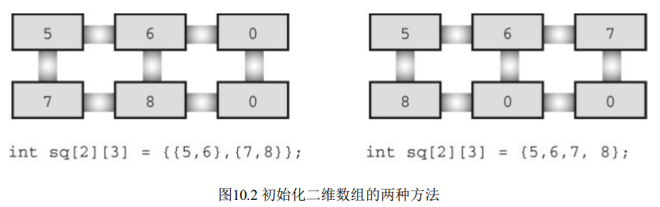
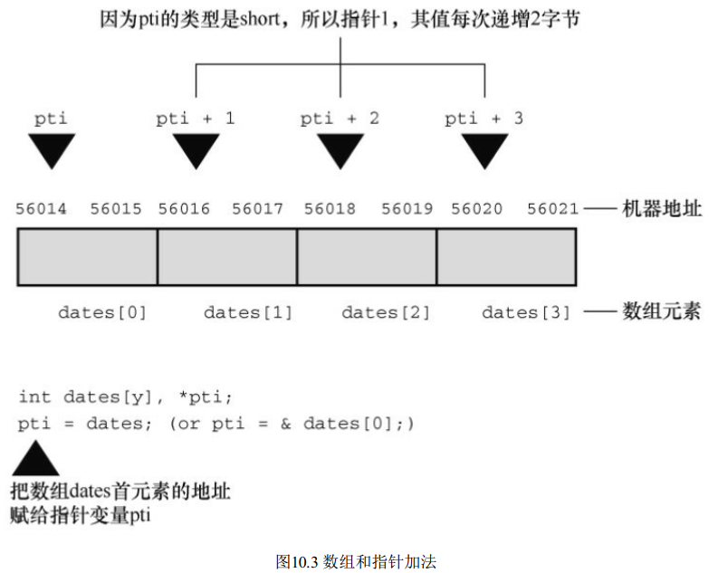
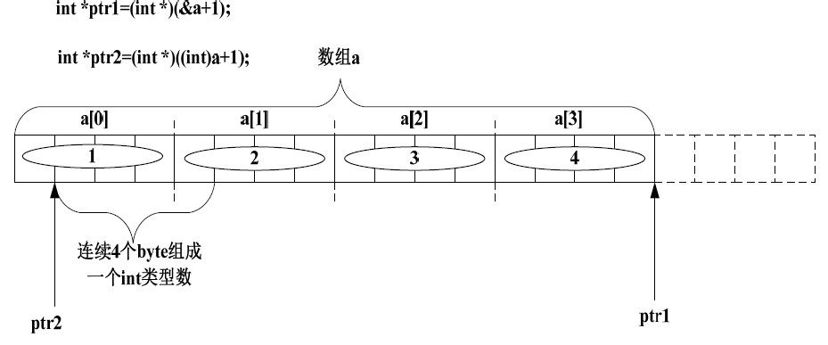
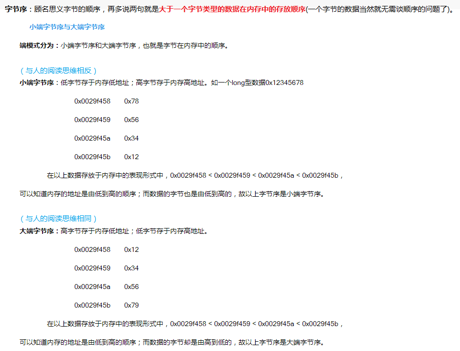
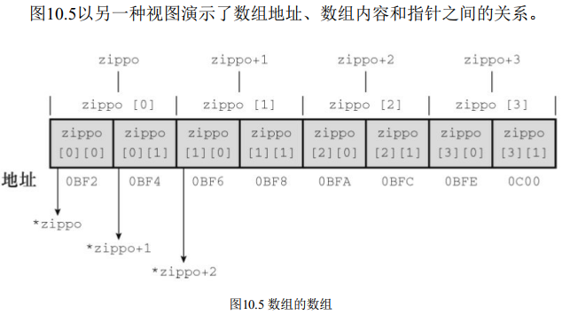

## 函数与指针基础

### 基本知识

什么是函数？ 函数（function） 是完成特定任务的独立程序代码
单元。

为什么要使用函数？ 首先， 使用函数可以省去编写重复代码的苦差   

许多程序员喜欢把函数看作是根据传入信息（输入） 及其生成的值或响应的动作（输出） 来定义的“黑盒”。 如果不是自己编写函数， 根本不用关心黑盒的内部行为。


#### 函数定义与调用

**打印表格** 

```c
#include <stdio.h>
#include <stdlib.h>

/*定义常量*/
#define NAME "GIGATHINK, INC."
#define ADDRESS "101 Megabuck Plaza"
#define PLACE "Megapolis, CA 94904"
#define WIDTH 40

void starbar(void); /* 函数原型 */
int main(void)
{
    starbar();
    printf("%s\n", NAME);
    printf("%s\n", ADDRESS);
    printf("%s\n", PLACE);
    starbar(); 		/* 使用函数 */
    return 0;
}

void starbar(void) 	/* 定义函数 */
{
    int count;
    for (count = 1; count <= WIDTH; count++)
        putchar('*');
    putchar('\n');
}
```

程序在上面程序的三个地方使用了starbar标识符：

- 函数原型（function prototype） 向编译器**声明函数**的类型，圆括号内**没有参数列表 要使用void表示**（推荐）； 
- 函数调用（function call） 表明在此处**执行函数**；
- 函数定义（function definition） 明确地**指定了函数**要做什么。 


#### 形参

传入函数的变量称为：形式参数（formal parameter） ， 简称形参。 和定义在函数中变量一样， **形式参数也是局部变量， 属该函数私有。**

#### 实参

在函数调用中， 实际参数（actual argument， 简称实参）传递给函数具体的值  。实际参数可以是常量、 变量， 或甚至是更复杂的表达式。 

无论实际参数是何种形式都要被求值， 然后**该值被拷贝给被调函数**相应的形式参数。 无论被调函数对拷贝数据进行什么操作， 都**不会影响**主调函数中的原始数据。 

如果两个参数都是数字， 但是类型不匹配， 编译器会把实际参数的类型**转换成形式参数的类型**。
例如， `imax(3.0, 5.0)`会被转换成`imax(3, 5)`。  

> **形式参数**是被调函数（called function） 中的变量;
>
>  **实际参数**是主调函数（calling function） 赋给被调函数的具体值;


#### return 

```c
/* lesser.c -- 找出两个整数中较小的一个 */
#include <stdio.h>
int imin(int, int);
int main(void)
{
    int evil1, evil2;
    printf("Enter a pair of integers (q to quit):\n");
    while (scanf("%d %d", &evil1, &evil2) == 2)
    {
        printf("The lesser of %d and %d is %d.\n",
               evil1, evil2, imin(evil1, evil2));
        printf("Enter a pair of integers (q to quit):\n");
    }
    printf("Bye.\n");
    return 0;
}

int imin(int n, int m)
{
    int min;
    if (n < m)
        min = n;
    else
        min = m;
    return min;
}
```

- 返回值不仅可以赋给变量， 也可直接被用作表达式的一部分 
- 返回值不一定是变量的值， 也可以是任意表达式的值 
- 返回值的类型与函数声明的类型不匹配 ，会发生**类型强转**
- 使用 return 语句的另一个作用是， 终止函数并**把控制返回给主调函数**的下一条语句 

#### 函数原型

函数原型指明了函数的返回值类型和函数接受的参数类型。这些信息称为该函数的签名（signature）

##### 原型的优点

之所以使用函数原型，是为了让编译器在第1次执行到该函数之前就知道如何使用它，捕获在使用函数时可能出现的许多错误或疏漏。如果编译器没有发现这些问题，就很难觉察出来。 

##### 原型参数问题

让编译器捕获在使用函数时可能出现的许多错误或疏漏。 如果编译器没有发现这些问题， 就很难觉察出来。   

为了表明函数确实**没有参数**， 应该在圆括号中使用void关键字：

```
void print_name(void); 
```


一些函数接受**不定参数**。 例如对于printf()， 第1个参数是字符串， 但是其余参数的类型和数量都不固定。 对于这种情况，ANSI C允许使用部分原型。 例如，对于printf()可以使用下面的原型：

```
int printf(const char *, ...);
```

这种原型表明，第1个参数是一个字符串，可能还有其他未指定的参数。

> C库通过stdarg.h头文件提供了一个定义[形参数量不固定的]函数的标准方法。 


#### 函数声明与函数类型

函数类型指的是返回值的类型， 不是函数参数的类型。 

声明函数时必须声明函数的类型。 带返回值的函数类型应该与其返回值类型相同， 而没有返回值的函数应声明为void类型。  

要正确地使用函数， 程序在第一次使用函数之前必须知道函数的类型。

- 方法之一是， 把完整的函数定义放在第1次调用函数的前面。 <u>然而，这种方法增加了程序的阅读难度。而且，要使用的函数可能在C库或其他文件中。</u>
- 因此， **通常的做法是提前声明函数（函数原型）， 把函数的信息告知编译器。**  


### 递归

每级函数调用都有自己的变量。 虽然每级递归都有自己的变量， 但是并没有拷贝函数的代码。  

除了为每次递归调用创建变量外， 递归调用非常类似于一个循环语句。
实际上，递归有时可用循环来代替，循环有时也能用递归来代替。 

最后， 递归函数必须包含能让递归调用停止的语句。 


#### 尾递归

最简单的递归形式是把递归调用置于函数的末尾， 即正好在 return 语句之前。 这种形式的递归被称为尾递归（tail recursion）


#### 递归还是循环

用递归和循环来计算都没问题， 那么到底应该使用哪一个？ 一般而言， 选择循环比较好。 首先， 每次递归都会创建一组变量， 所以递归使用的内存更多， 而且每次递归调用都会把创建的一组新变量放在栈中。 递归调用的数量受限于内存空间。 其次， 由于每次函数调用要花费一定的时间， 所以递归的执行速度较慢。   


递归在处理倒序时非常方便（在解决这类问题中， 递归比循环简单） 

### 编译多源代码文件

#### gcc编译

将编译两个文件并生成名为`a.out`的可执行文件 ,还生成两个名为`file1.o`和`file2.o`的目标文件。

```
gcc file1.c file2.c 
```

 如果后来改动了`file1.c`， 而`file2.c`不变，可以重复利用`file2.o`文件 

```
gcc file1.c file2.o 
```


#### 使用头文件

##### 函数原型

把函数原型放在头文件中， 就不用每次在其他文件中使用函数文件时都写出函数的原型。 使用`#include`指令包含头文件即可。 

C 标准库就是这样做的， 例如， 把I/O函数原型放在stdio.h中， 把数学函数原型放在math.h中。 

##### 符号常量 

程序中经常用C预处理器定义符号常量 ，更好的做法是把define 指令放进头文件， 然后在每个源文件中使用#include指令包含该文件即可。


**总之， 把函数原型和已定义的字符常量放在头文件中是一个良好的编程习惯  。**


##### 酒店例子

```c
/* usehotel.c -- 房间费率程序 */
/* 与程序清单9.10一起编译 */
#include <stdio.h>

/*
在UNIX和DOS环境中，#include "hotels.h"指令中的双引号表明被包含的文件位于当前目录中(通常是包含源代码的目录)
*/
#include "hotel.h" /* 定义符号常量,声明函数*/
int main(void)
{
    int nights;
    double hotel_rate;
    int code;
    while ((code = menu()) != QUIT)
    {
        switch (code)
        {
        case 1:
            hotel_rate = HOTEL1;
            break;
        case 2:
            hotel_rate = HOTEL2;
            break;
        case 3:
            hotel_rate = HOTEL3;
            break;
        case 4:
            hotel_rate = HOTEL4;
            break;
        default:
            hotel_rate = 0.0;
            printf("Oops!\n");
            break;
        }
        nights = getnights();
        showprice(hotel_rate, nights);
    }
    printf("Thank you and goodbye.\n");
    return 0;
}
```

```c
/* hotel.c -- 酒店管理函数 */
#include <stdio.h>
#include "hotel.h"
int menu(void)
{
    int code, status;
    printf("\n%s%s\n", STARS, STARS);
    printf("Enter the number of the desired hotel:\n");
    printf("1) Fairfield Arms 2) Hotel Olympic\n");
    printf("3) Chertworthy Plaza 4) The Stockton\n");
    printf("5) quit\n");
    printf("%s%s\n", STARS, STARS);
  	
  	//输入的不是数字，或者数字不在（1,5）之间，则要求重新输入
    while ((status = scanf("%d", &code)) != 1 ||
            (code < 1 || code > 5))
    {
        if (status != 1)
            scanf("%*s"); // 处理非整数输入
        printf("Enter an integer from 1 to 5, please.\n");
    }
    return code;
}
int getnights(void)
{
    int nights;
    printf("How many nights are needed? ");
    while (scanf("%d", &nights) != 1)
    {
        scanf("%*s"); // 处理非整数输入
        printf("Please enter an integer, such as 2.\n");
    }
    return nights;
}
void showprice(double rate, int nights)
{
    int n;
    double total = 0.0;
    double factor = 1.0;
    for (n = 1; n <= nights; n++, factor *= DISCOUNT)
        total += rate * factor;
    printf("The total cost will be $%0.2f.\n", total);
}
```

```c
/* hotel.h -- 符号常量和 hotel.c 中所有函数的原型 */
#define QUIT 5
#define HOTEL1 180.00
#define HOTEL2 225.00
#define HOTEL3 255.00
#define HOTEL4 355.00
#define DISCOUNT 0.95
#define STARS "**********************************"
// 显示选择列表
int menu(void);
// 返回预订天数
int getnights(void);
// 根据费率、 入住天数计算费用
// 并显示结果
void showprice(double rate, int nights);

```

**重难点：**

- 在UNIX和DOS环境中， #include "hotels.h"指令中的**双引号**表明被包含的**文件位于当前目录中**（通常是包含源代码的目录） 。 


- `menu()`和`getnights()`函数通过测试`scanf()`的返回值来跳过非数值数据， 而且调用 `scanf("%*s")`跳至下一个空白字符。  

- menu()函数中是如何检查非数值输入和超出范围 的数据：

  ```c
  while ((status = scanf("%d", &code)) != 1 ||(code < 1 || code > 5))
  ```

  以上代码段利用了C语言的两个规则： **从左往右对逻辑表达式求值； 一旦求值结果为假， 立即停止求值**。 在该例中， 只有在scanf()成功读入一个整数值后， 才会检查code的值。 


### 指针基础

#### 查找地址：&运算符

指针（pointer） 是C语言最重要的（有时也是最复杂的） 概念之一， **指针也是变量，用于储存变量的地址。**指针变量的大小是 8字节（其他系统中地址的大小可能不是8字节） 。  

概括地说，如果主调函数不使用return返回的值，则必须通过地址才能修改主调函数中的值。

scanf()函数中就使用地址作为参数。 因为**scanf的返回值表示的是读取到的数量**，因此要获取输入，就必须传递地址让它直接修改主调函数中的值。

#### 使用指针的原因

**使用指针的原因**：在c语言中，调用函数时，参数传递使用的是**值传递**，也就是将主调函数中的变量复制一份给被调用的函数，因此在被调用的函数中，做任何操作，都无法影响到主调函数的变量

但有时候，我们需要在调用函数中修改主调函数的变量，如下面的例子：

```c
/* 交换两个变量的值 */

#include <stdio.h>
void interchange(int u, int v);
int main(void)
{
    int x = 5, y = 10;
    printf("Originally x = %d and y = %d.\n", x, y);
    interchange(x, y);
    printf("Now x = %d and y = %d.\n", x, y);
    return 0;
}
void interchange(int u, int v)
{
    int temp;
    printf("Originally u = %d and v = %d.\n", u, v);
    temp = u;
    u = v;
    v = temp;
    printf("Now u = %d and v = %d.\n", u, v);
}
```


从根本上看， 指针（pointer） 是一个值为内存地址的变量（或数据对象） 。  

正如char类型变量的值是字符， int类型变量的值是整数， 指针变量的值是地址。 

假设一个指针变量名是ptr， 

```c
ptr = &pooh; // 把pooh的地址赋给ptr 
```

ptr和&pooh的区别：`ptr`是变量，而`&pooh`是常量。 `ptr`是可修改的左值， 而`&pooh`是右值。 

```c
ptr = &bah; // 把ptr指向bah， 而不是pooh 
&pooh=&bah; // 报错
```


#### 间接运算符

通过间接运算符*（indirection operator） 可以获取 储存在指针中的地址 所指向的变量的值

> 该运算符有时也称为解引用运算符（dereferencing operator）  

```c
nurse = 22;
ptr = &nurse; // 指向nurse的指针
nurse_copy = *ptr; // 把ptr指向的地址上的值赋给nurse_copy
执行以上3条语句的最终结果是把22赋给nurse_copy。
```

由此可见， 使用地址和间接运算符可以间接完成上面这条语句的功能，这也是“间接运算符”名称的由来。 

#### 声明指针

你也许认为是这样声明：

```c
pointer ptr; // 不能这样声明指针 
```

声明指针变量时**必须指定指针所指向变量的类型**。

因为

- 不同的变量类型占用不同的存储空间， 一些指针操作要求知道操作对象的大小。 

- 另外， 程序必须知道储存在指定地址上的数据类型， long和float可能占用相同的存储空间， 但是它们储存数字却大相径庭。


```c
int * pi; // pi是指向int类型变量的指针
char * pc; // pc是指向char类型变量的指针
float * pf, * pg; // pf、 pg都是指向float类型变量的指针
```

  *和指针名之间的空格可有可无。 通常， 程序员在声明时使用空格， 在解引用变量时省略空格。 

例子：

```c
/* swap3.c -- 使用指针解决交换函数的问题 */
#include <stdio.h>
void interchange(int * u, int * v);
int main(void)
{
    int x = 5, y = 10;
    printf("Originally x = %d and y = %d.\n", x, y);
    interchange(&x, &y); // 把地址发送给函数
    printf("Now x = %d and y = %d.\n", x, y);
    return 0;
}
void interchange(int * u, int * v)
{
    int temp;
    temp = *u; // temp获得 u 所指向对象的值
    *u = *v;
    *v = temp;
}
```


#### 值传递与地址传递

一般而言， 可以把变量相关的两类信息传递给函数。 如下面形式的函数调用， 那么**传递的是x的值**： 

```c
function1(x);
```

如果是下面形式的函数调用， 那么**传递的是x的地址**：

```c
function2(&x);
```

第1种形式要求函数定义中的形式参数必须是一个与x的类型相同的变量：

```c
int function1(int num)
```

第2种形式要求函数定义中的形式参数必须是一个指向正确类型的指针：

```c
int function2(int * ptr)
```

因此

- 如果要计算或处理值， 那么使用第 1 种形式的函数调用； 


- 如果要在被调函数中改变主调函数的变量， 则使用第2种形式的函数调用。 

> 我们用过的scanf()函数就是这样。 当程序要把一个值读入变量时，调用的是`scanf("%d", &num)`。scanf()读取一个值， 然后把该值储存到指定的地址上。 

#### 变量名称、 地址和变量值

变量的名称、 地址和变量的值之间关系密切。

- 编写程序时， 可以认为变量有两个属性： 名称和值（还有其他性质，如类型，暂不讨论） 。
- 计算机编译和加载程序后， 认为变量也有两个属性： 地址和值。

**因此，地址就是变量在计算机内部的名称。** 


### 函数指针

**函数指针就是指向函数的指针**，该指针变量中存储的是一个函数在内存中的入口地址，我们知道数组名可以理解为存储数组第一个元素的内存地址，同理可以知道，一个**函数名就是这个函数的源代码在内存中的起始地址**，编译器将不带括号的函数名解释为该函数的入口地址。

这里给出一个需要使用到函数指针的例子：

将数组中的值按照升序或者降序进行排序，我们可以写两个函数`AscendingSort`与 `DescendingSort`，

```c
// 升序
void AscendingSort(int arr[],int n){
    int i,j,k;
    for(i=0;i<n-1;i++){
        k=i;
        for(j=i+1;j<n;j++){
            if(arr[k]>arr[j]){ // 判断条件
                k=j;
            }
        }
        if(k!=i){
            int temp=arr[k];
            arr[k]=arr[i];
            arr[i]=temp;
        }
    }
}
```


```c
// 降序
void DescendingSort(int arr[],int n){
    int i,j,k;
    for(i=0;i<n-1;i++){
        k=i;
        for(j=i+1;j<n;j++){
            if(arr[k]<arr[j]){ // 判断条件
                k=j;
            }
        }
        if(k!=i){
            int temp=arr[k];
            arr[k]=arr[i];
            arr[i]=temp;
        }
    }
}
```

我们发现上面两个函数除了判断条件不同，其他一模一样，冗余代码太多了。

我们可以定义`SelectionSort`函数，在其内部编写通用的代码，然后指定特定的函数作为判断条件

```c
#include <stdio.h>

int DescendingSort(int a,int b);
int AscendingSort(int a,int b);
void SelectionSort(int arr[],int n,int (*compare)(int a, int b));

void SelectionSort(int arr[],int n, int (*compare)(int a, int b)){
    int i,j,k;
    for(i=0;i<n-1;i++){
        k=i;
        for(j=i+1;j<n;j++){
            if((*compare)(arr[k],arr[j])){ // 使用函数指针进行判断
                k=j;
            }
        }
        if(k!=i){
            int temp=arr[k];
            arr[k]=arr[i];
            arr[i]=temp;
        }
    }
}

int DescendingSort(int a,int b){
    return a<b;
}
int AscendingSort(int a,int b){
    return a>b;
}

int main(int argc, char *argv[])
{
    int score[]={4,2,5,1,7};
    int order;
    printf("请输入排序方式：1.升序，2降序：");
    scanf("%d",&order);
    if(order==1){
        SelectionSort(score,5,AscendingSort);//升序排序
    }else if(order==2) {
        SelectionSort(score,5,DescendingSort);//降序排序
    }
    //打印结果
    for(int i=0;i<(sizeof(score)/sizeof(int));i++){
        printf("%d ",score[i]);
    }
    return 0;
}
```

接下来解读一下**函数指针的定义方式** `int (*compare)(int a, int b)`：

`compare--->*--->()--->int`

由于括号的优先级最高，从左向右结合，所以`compare`与`*`先结合，表示`compare`是一个指针。然后是第二个参数`(int a,int b)` 与`int`。表示`compare`指针指向的是一个有两个整型形参、返回值为整型的函数。

如果没有括号的话`int *compare (int a, int b)`，**声明的是函数**：

`compare--->()--->*--->int`

由于括号有最高优先级，因此先解释括号()，表示compare是一个函数名，然后是*，因此该定义声明的是：一个两个整型参数、返回值为整型指针的函数。


## 数组与指针进阶

### 数组


#### 数组初始化

在C99标准之前， 声明数组时只能在方括号中使用整型常量表达式。所谓整型常量表达式，是由整型常量构成的表达式。且表达式的值必须大于0：

```c
int n = 5;
int m = 8;
float a1[5]; // 可以
float a2[5*2 + 1]; //可以
float a3[sizeof(int) + 1]; //可以
float a4[-4]; // 不可以， 数组大小必须大于0
float a5[0]; // 不可以， 数组大小必须大于0
float a6[2.5]; // 不可以， 数组大小必须是整数
float a7[(int)2.5]; // 可以， 已被强制转换为整型常量
float a8[n]; // C99之前不允许
float a9[m]; // C99之前不允许
```

有时需要把**数组设置为只读**。这样程序只能从数组中检索值，不能把新值写入数组，应该用`const`声明和初始化数组。 

````c
const int days[MONTHS] = {31,28,31,30,31,30,31,31,30,31,30,31}; 
````

初始化列表中的值<u>少于数组元素个数</u>时， 编译器会把**剩余的元素都初始化为0**。 

```
int some_data[4] = {1492, 1066};
```

初始化列表中的值<u>多于数组元素个数</u>， 编译器将其视为错误。

 ```c
int some_data[2] = {1492, 1066, 2233}; // 错误
 ```

可以省略方括号中的数字，让编译器**自动匹配数组大小**和初始化列表中项数 

```c
const int days[] = { 31, 28, 31, 30, 31, 30, 31, 31,30, 31 };
```


**使用未初始化的数组，不会报错，但是会获得意想不到的值**

```c
/* no_data.c -- 为初始化数组 */
#include <stdio.h>
#define SIZE 4
int main(void)
{
    int no_data[SIZE]; /* 未初始化数组 */
    int i;
    printf("%2s%14s\n", "i", "no_data[i]");
    for (i = 0; i < SIZE; i++)
        printf("%2d%14d\n", i, no_data[i]);
    return 0;
}
```


注意for循环中的测试条件。 由于人工计算容易出错， 所以**让计算机来计算数组的大小**。 sizeof运算符给出它的运算对象的大小（以字节为单位） 。

```c
/* day_mon2.c -- 让编译器计算元素个数 */
#include <stdio.h>
int main(void)
{
    const int days[] = { 31, 28, 31, 30, 31, 30, 31, 31,30, 31};
    int index;
    int arr_length=sizeof days / sizeof days[0]; // 获取数组长度
    for (index = 0; index < arr_length;index++)
        printf("Month %2d has %d days.\n", index + 1, days[index]);
    return 0;
}
```

所以`sizeof days`是整个数组的大小（以字节为单位），`sizeof day[0]`是数组中一个元素的大小（以字节为单位） 。 整个数组的大小除以单个元素的大小就是数组元素的个数。 


#### 指定初始化器

C99 增加了一个新特性： 指定初始化器（designated initializer）。利用该特性**可以初始化指定位置的数组元素**。

例如， 只初始化数组中的最后一个元素。 对于传统的C初始化语法， 必须初始化最后一个元素之前的所有元素，才能初始化它：

```c
int arr[6] = {0,0,0,0,0,212}; // 传统的语法
```

而C99规定，可以在初始化列表中使用带方括号的下标指明待初始化的元素：

```c
int arr[6] = {[5] = 212}; // 把arr[5]初始化为212 
```


重要例子：

```c
#include <stdio.h>
#define MONTHS 12
int main(void)
{
    int days[MONTHS] = { 31, 28, [4] = 31, 30, 31, [1]= 29};
    int i;
    for (i = 0; i < MONTHS; i++)
        printf("%2d %d\n", i + 1, days[i]);
    return 0;
}
```

```
1 31
2 29
3 0
4 0
5 31
6 30
7 31
8 0
9 0
10 0
11 0
12 0
```

以上输出揭示了指定初始化器的3个重要特性。

1. 如果指定初始化器后面有多个值，那么后面这些值将被用于初始化指定元素后面的元素。

   > 如该例中的初始化列表中的片段： [4] = 31,30,31，等价于 days[4]初始化为31，days[5]和days[6]将分别被初始化为30和31。 

2. 如果再次初始化指定的元素， 那么**最后的初始化将会取代之前的初始化。** 

   > 例如上例，初始化列表开始时把days[1]初始化为28， 但是days[1]又被后面的指定初始化[1] = 29初始化为29 

3. 未初始化的元素都会被设置为0。  


如果未指定元素大小会怎样？

```c
int stuff[] = {1, [6] = 23}; //会发生什么？
int staff[] = {1, [6] = 4, 9, 10}; //会发生什么？
```

编译器会把数组的大小设置为足够装得下初始化的值。  


#### 赋值

注意问题：

C数组不能越界、不允许把数组作为一个单元赋给另一个数组【1】、除初始化以外也不允许使用花括号列表的形式赋值【2】。  

```c
/* 一些无效的数组赋值 */
#define SIZE 5
int main(void)
{
    int oxen[SIZE] = {5,3,2,8}; /* 初始化没问题 */
    int yaks[SIZE];
    yaks = oxen; /* 不允许【1】 */
    yaks[SIZE] = {5,3,2,8}; /* 不起作用【2】 */
    yaks[SIZE] = oxen[SIZE]; /* 数组下标越界 */
}
```


#### 数值边界问题

编译器**不会检查数组下标**是否使用得当。 

如果为安全起见，编译器必须在运行时添加额外代码检查数组的每个下标值，这**会降低程序的运行速度**。 

C 相信程序员能编写正确的代码，这样的程序运行速度更快。  

例子（数组越界的意外问题）：

```c
// bounds.c -- 数组下标越界
#include <stdio.h>
#define SIZE 4
int main(void)
{
    int value1 = 44;
    int arr[SIZE];
    int value2 = 88;
    int i;
    printf("value1 = %d, value2 = %d\n", value1, value2);
  /* 该编译器把value2储存在数组的前一个位置， 把value1储存在数组的后一个位置 */
    /*进行越界赋值，对数组前、数组后都进行了修改*/
    for (i = -1; i <= SIZE; i++)
        arr[i] = 2 * i + 1;
    for (i = -1; i < 7; i++)
        printf("%2d %d\n", i, arr[i]);
    // 结果影响了value1和value2的值
    printf("value1 = %d, value2 = %d\n", value1, value2);
    printf("address of arr[-1]: %p\n", &arr[-1]);
    printf("address of arr[4]: %p\n", &arr[4]);
    printf("address of value1: %p\n", &value1);
    printf("address of value2: %p\n", &value2);
    return 0;
}
```

```
value1 = 44, value2 = 88
-1 -1
 0 1
 1 3
 2 5
 3 7
 4 9
 5 5
 6 48
value1 = 9, value2 = -1
address of arr[-1]: 0060FEF4
address of arr[4]: 0060FF08
address of value1: 0060FF08
address of value2: 0060FEF4
```

解读：该编译器把value2储存在数组的前一个位置， 把value1储存在数组的后一个位置（其他编译器在内存中储存数据的顺序可能不同） 。 

在上面的输出中， arr[-1]与value2对应的内存地址相同， arr[4]和value1对应的内存地址相同。因此，**使用越界的数组下标会导致程序改变其他变量的值。**

> 不同的编译器运行该程序的结果可能不同， 有些会导致程序异常中止。 


### 多维数组

理解为 **数组的数组**

```c
float rain[5][12]; 
```

内含5个数组元素的数组， 每个数组元素内含12个float类型的元素

初始化的方法有如下2种：长度不够的初始化为0

```c
int sq[2][3]={{5,6},{7,8}};
int sq[2][3]={5,6,7,8};
```




### 数组与指针

数组表示法其实是在变相地使用指针。 

**数组名是数组首元素的地址。** 也就是说，如果arr是一个数组， 下面的语句成立：

```c
arr == &arr[0]; // 数组名是该数组首元素的地址 
```
#### 指针加减

那对数组的指针加减运算会有什么结果呢？

```c
// pnt_add.c -- 指针地址
#include <stdio.h>
#define SIZE 4
int main(void)
{
    short dates[SIZE];
    short * pti;
    double bills[SIZE];
    double * ptf;
    pti = dates; // 把数组地址赋给指针
    ptf = bills;
    short i;
    printf("%23s %15s\n", "short", "double");
    for (i = 0; i < SIZE; i++)
        printf("pointers + %d: %10p %10p\n", i, pti + i,ptf + i);
    return 0;
}
```

```
                   short     double
pointers + 0:   0060FEFC   0060FED8
pointers + 1:   0060FEFE   0060FEE0
pointers + 2:   0060FF00   0060FEE8
pointers + 3:   0060FF02   0060FEF0
```

在C中，**指针加1指的是增加一个存储单元(它所指向类型的大小)**。 对数组而言，这意味着把加1后的地址是下一个元素的地址， 而不是下一个字节的地址。



> 这是为什么必须声明指针所指向对象类型的原因之一。 只知道地址不够，因为计算机要知道储存对象需要多少字节（即使指针指向的是标量变量，也要知道变量的类型，否则*pt 就无法正确地取回地址上的值） 。 


#### 指针取值

在指针前面使用\*运算符可以得到该指针所指向对象的值。
**指针加1， 指针的值会增加它所指向类型的大小**（以字节为单位） 

```c
dates + 2 == &date[2] 		// 相同的地址
*(dates + 2) == dates[2] 	// 相同的值
```

顺带一提， 不要混淆 \*(dates+2)和\*dates+2。 间接运算符（*） 的优先级高于+， 所以\*dates+2相当于(\*dates)+2：

```c
*(dates + 2) // dates第3个元素的值
*dates + 2 // dates第1个元素的值加2 
```

例子(使用指针获取数组中的值，打印月份)：

```c
/* 使用指针获取数组中的值，打印月份 */
#include <stdio.h>
#define MONTHS 12
int main(void)
{
    int days[MONTHS] = {31, 28, 31, 30, 31, 30, 31, 31, 30, 31, 30, 31};
    int index;
    for (index = 0; index < MONTHS; index++)
        printf("Month %2d has %d days.\n", index + 1, *(days + index)); //与 days[index]相同
    return 0;
}
```


#### 数组指针与指针数组

参考：https://www.cnblogs.com/mq0036/p/3382732.html

初学者总是分不出指针数组与数组指针的区别。其实很好理解：

- 指针数组：首先**它是一个数组**，数组的元素都是指针，数组占多少个字节由数组本身的大小决定，每一个元素都是一个指针，在32 位系统下任何类型的指针永远是占4 个字节。它是“储存指针的数组”的简称。
- 数组指针：首先**它是一个指针**，它指向一个数组。在32 位系统下任何类型的指针永远是占4 个字节，至于它指向的数组占多少字节，不知道，具体要看数组大小。它是“指向数组的指针”的简称。

下面到底哪个是数组指针，哪个是指针数组呢：

```c
A)
int* p1[10];
B)
int (*p2)[10];
```

“[]”的优先级比“\*”要高。p1 先与“[]”结合，等价于`int* (p1[10])`构成一个数组的定义，数组名为p1，`int *`修饰的是数组的内容，即数组的每个元素。那现在我们清楚，这是一个数组，其包含10 个指向int 类型数据的指针，即指针数组。至于p2 就更好理解了，在这里“（）”的优先级比“[]”高，“\*”号和p2 构成一个指针的定义，指针变量名为p2，int 修饰的是数组的内容，即数组的每个元素。数组在这里并没有名字，是个匿名数组。那现在我们清楚p2是一个指针，它指向一个包含10 个int 类型数据的数组，即数组指针。我们可以借助下面的图加深理解：


请正确声明以下各变量：

1. psa是一个内含20个元素的数组，每个元素都是指向int的指针
2. pstr是一个指向数组的指针，该数组内含20个char类型的值

**答案：**

 `char * psa[20];`

[]比\*的优先级高，所以在没有圆括号的情况下，psa先与[20]结合，然后再与\*结合。因此该声明与`char *(psa[20]);`相同。

`char (*pstr)[20];`

对第2小题而言，`char *pstr[20]`不正确。这会让pstr成为一个指针数组，而不是一个指向数组的指针。具体地说，如果使用该错误声明，pstr就指向一个char类型的值（即数组的第1个成员），而pstr + 1则指向下一个字节。使用正确的声明，pstr是一个指针变量，而不是一个数组名。而且pstr+ 1指向起始字节后面的第20个字节。

在二维数组的定义中还会讲到该问题。


#### 数组名与指针的区别

> 参考：https://www.cnblogs.com/liqiuhao/p/7737539.html
>
> 参考：https://www.cnblogs.com/litifeng/articles/7862490.html

不少的C语言初学者都知道，数组名相当于指针，指向数组的首地址，而函数名相当于函数指针，指向函数的入口地址。现在有这样一个问题，如果对数组名取地址，那得到的会是什么呢？很多人立刻会想到：给指针取地址，就是指针的指针，既二级指针嘛！当然这样的结论是错误的。

**数组名 != 指针**。数组名是一个标识符，它标识出我们申请的一连串内存空间，而且这个空间内的元素类型是相同的——即**数组名代表的是一个内存块及这个内存块中的元素类型** 。只是在大多数情况下数组名会“**退化**”为指向**第一个元素的指针**（C标准使用的decay和converted这两个词）。


在《C和指针》p142中说到，在**以下两种场合下，数组名并不是用指针常量**来表示：

1. 当数组名作为`sizeof`操作符。sizeof返回整个数组的长度，而不是指向数组的指针的长度。
2. 单目操作符`&`的操作数时。 取一个数组名的地址所产生的**是一个指向数组的指针**，而不是一个指向某个指针常量的指针。


接下来进行详细的分析。

##### `&`运算符的区别

```c
#include <stdio.h>

int main(int argc, char *argv[])
{
    int a[5]={1,2,3,4,5};
    printf("&a = %p \r\n",&a);
    printf("a = %p \r\n",a);
    printf("&a+1 = %p \r\n",&a+1);
    printf("a+1 = %p \r\n",a+1);
    return 0;
}
//  &a = 0x7ffeefbff590
//   a = 0x7ffeefbff590
//&a+1 = 0x7ffeefbff5a4
// a+1 = 0x7ffeefbff594 
```

`a`和`&a`指向的是同一块地址，但他们+1后的效果不同，`a+1`是一个元素的内存大小（增加4），而`&a+1`增加的是整个数组的内存大小（增加40）。既`a`和`&a`的指向和`&a[0]`是相同的，但性质不同！这里其实发生了**退化的现象**，具体请看下一节内容。

`&a`取得的是整个数组的地址！既数组名取地址等价于对数组取地址。之所以有`&a`，其实这里的`a`的意义早已经不是当初那个数组名了，**它此时代表了整个数组**。

**结论**：其实`a`和`&a`结果都是数组的首地址，但**他们的类型是不一样**。

- a表示`&a[0]`，也即对**数组首元素取地址**，a+1表示首地址+sizeof(元素类型)。
- `&a`虽然值为数组首元素地址，但类型为：`类型 (*)[数组元素个数]`，所以&a+1大小为：首地址+sizeof(a)。

再看一个例子：

```c
#include <stdio.h>

int main(int argc, char *argv[]){
    int **p1;
    int (*p2)[5];
    int (*p3)[5];
    int a[]={1,2,3,4,5};
    p1=&a; //Incompatible pointer types assigning to 'int **' from 'int (*)[5]'
    p2=&a;
    p3=a;//Incompatible pointer types assigning to 'int (*)[5]' from 'int [5]'; take the address with &

    printf("&a = %p\r\n",&a);
    printf(" a = %p\r\n",a);
    printf("p1 = %p\r\n",p1);
    printf("p2 = %p\r\n",p2);
    printf("p3 = %p\r\n",p3);
    printf("p1+1 = %p\r\n",p1+1);
    printf("p2+1 = %p\r\n",p2+1);
    printf("p3+1 = %p\r\n",p3+1);
    return 0;
}
//&a = 0x7ffeefbff590
// a = 0x7ffeefbff590
//p1 = 0x7ffeefbff590
//p2 = 0x7ffeefbff590
//p3 = 0x7ffeefbff590
//p1+1 = 0x7ffeefbff598
//p2+1 = 0x7ffeefbff5a4
//p3+1 = 0x7ffeefbff5a4

```

如果按照”数组名就是指针”的思想来，`&a`应该产生一个`int**`类型的指针，但是编译器报了p1的警告：指针类型不兼容，而p2却没有报警告，p3也报警告，那么p1和p2的区别在哪呢？

`&a` 是整个数组的首地址，`a`是数组首元素的首地址。

p1是**一个指向一个指向整数指针的指针**，进行p1++运算，得到的将是p1+8（我是64位环境）。而p2表示的是一个**指向一个元素类型为整数，元素个数为5的内存块的指针** ，进行p2++运算，得到的将是p2+sizeof(a)。

所以`&a`返回的指针便是指向数组的指针，跟a（一个指向a[0]的指针）在指针的类型上是有区别的。

一句话总结就是：数组就是数组，有着自己的特性。

> 参考：https://blog.csdn.net/daniel_ice/article/details/6857019


##### `sizeof`运算符的区别

`sizeof(数组名)==数组大小`

`sizeof(指针)==指针大小`

复杂例子：

```c
#include <stdio.h>

int main(int argc, char *argv[])
{
    int buf0[10];
    int *p = buf0;
    
    int buf1[2][5];
    int * buf2[]={12345,12345,12345,12345,12345,123456};//注：buf2是指针数组(与[]先结合)，数组的元素是指针
    int **tmp = buf2;
    
    printf("sizeof(buf0)=%d,sizeof(p)=%d \r\n",sizeof(buf0),sizeof(p));
    printf("sizeof(buf1)=%d,sizeof(buf1[1])=%d \r\n",sizeof(buf1),sizeof(buf1[1]));
    printf("sizeof(buf2)=%d,sizeof(buf2[1])=%d \r\n",sizeof(buf2),sizeof(buf2[1]));
    printf("sizeof(tmp)=%d\r\n",sizeof(tmp));
    printf("sizeof(*tmp)=%d\r\n",sizeof(*tmp));
    printf("sizeof(**tmp)=%d\r\n",sizeof(**tmp));
    printf("sizeof(函数)=%d\r\n",sizeofTest(buf0));//出现退化情况，详情看下一小节
    return 0;
}

int sizeofTest(int arr[]){
    return sizeof(arr);//8,arr是指针，并不等同于数组名
}
```

##### 退化的情况

情况1：算术运算与数组取下标操作符

**在作为右值参与运算的时候，数组名会自动”退化“为指向首元素的指针**

```c
char a[] = "hello";
char *p = a + 1; //*p='e'
```

我们常见的数组取下标操作符，c标准中对它的定义是**等价于`*(p + offset)`运算**。也是就说，你写a[3]其实等价于`*(a+3)`，可以看到括号内是一个算术运算，于是a“退化”为一个指针，随后参与进行计算和解引用。

​	

情况2：函数调用传递数组

之前一直有个问题，为什么处理数组的函数需要传递数组的长度，通过sizeof（数组名）不是可以确定数组的长度吗？

```c
int buf0[10];
printf("sizeof(buf0)=%d \r\n",sizeof(buf0));
//sizeof(buf0)=40
```

先来说说函数原型，假设数组为int a[5]，我们可以有以下几种写法：

```
void test(int arr[5])
void test(int [5])
void test(int*)
```

第一种写法是最好的，清晰（这个是对的，对于代码阅读者而言）而且可以告诉编辑器这个数组的大小。但是，**这三种声明在编译器看来只有一种**：`void test(int*)`, 所以那个5不过是一个心里安慰。

所以说，test函数得到的是一个值为arr“退化”后**指向数组首元素（内存块首地址）的指针** ，**在test函数内部是不知道arr是一个数组的，它仅仅认为它是一个整数指针。**

因此，使用sizeof（指针）得到的是指针变量的大小：

```c
int test(int arr[]){
    return sizeof(arr);// arr只是指针
}
int main(){
    int a[10];
    printf("%d\r\n",test(a)); //8
}
```

虽然数组名不等于指针，但是我们依然可以使用数组取下标操作符进行运算，因为即使arr是一个数组名，它被**用作数组取下标操作符的操作数时也会“退化”为指针**


##### 高级例子

```c
#include <stdio.h>
int checkSystem(void);

int main(int argc, char *argv[]){
    
    int a[4]={1,2,3,4};
    printf("%p \r\n",a);
    printf("%p \r\n",(long)a); //(long)a表示将数组的首地址强转为long类型。
    
    int *ptr1=(int *)(&a+1); //指向a数组后面的内存单元，&a+1表示向后移16个存储单元
    int *ptr2=(int *)((long)a+1); //表示a的存储单元的地址增加一个字节(byte)，而不会像上面的增加sizeof(a)的大小
    if(checkSystem()){
        printf("小端模式 \r\n");
    }else{
        printf("大端模式 \r\n");
    }
    
    printf("%x \r\n",ptr1[-1]);// ptr1[-1]其实指向的是a数组的最后一个单元，*ptr1则表示a数组的地址后移一个字节之后的4个连续存储单元所存储的值
    printf("%x \r\n",*ptr2); 
    // 如果字节序是小端模式的话，*ptr2 的值为0x 02 00 00 00。
    // 如果字节序是大端模式的话，*ptr2 的值为0x 00 00 01 00。
}

int checkSystem(){
    //利用共同体所有变量共享同一起始地址，来检查字节序
    union check{
        int i;
        char ch;
    } c;
    c.i = 1;
    // 地址从左向右递增
    // 小端模式的情况
    00000001 00000000 00000000 00000000 int
    00000001  char
    // 大端模式的情况
    00000000 00000000 00000000 00000001 int
    00000000  char   
    return (c.ch == 1); //如果当前系统为小端模式，返回1；如果为大端模式，返回0；
}
```


代码的图解如下：




关于字节序的知识如下：





### 函数、数组、指针

#### 处理数组的函数定义

要编写一个处理数组的函数， 比如数组求和。函数要处理数组必须知道何时开始、 何时结束。有2种传参方法。

**第一种方法**如下：

```c
int sum(int *ar, int n);
```

第1个形参告诉函数该数组的地址和数据类型，第2个形参告诉函数该数组中元素的个数。


可以选择是使用**数组表示法**还是**指针表示法**，使用数组表示法， 让函数是处理数组的这一意图更加明显。  

由于函数原型可以省略参数名，所以下面4种原型都是等价的：

```c
int sum(int *ar, int n);
int sum(int *, int);
int sum(int ar[], int n);
int sum(int [], int);
```

但是，在函数定义中不能省略参数名。下面两种形式的函数定义等价：

```c
int sum(int *ar, int n){ 
  //其他代码已省略
} 
int sum(int ar[], int n);{ 
  //其他代码已省略
} 
```


> 只有在函数原型或函数定义头中，才可以用int ar[]代替int * ar：int sum (int ar[], int n); 


**第二种方法**：

```c
int sum(int * start, int * end);
```

第1个指针指明数组的开始处（与前面用法相同），第2个指针指明数组的结束处。 

```c
/* sum_arr2.c -- 数组元素之和 */
#include <stdio.h>
#define SIZE 10
int sum(int * start, int * end);
int main(void)
{
    int marbles[SIZE] = { 20, 10, 5, 39, 4, 16, 19, 26, 31, 20 };
    long answer;
    answer = sum(marbles, marbles + SIZE);
    printf("The total number of marbles is %ld.\n", answer);
    return 0;
}
/* 使用指针算法，进行数组求和 */
int sum(int * start, int * end)
{
    int total = 0;
    while (start < end)
    {
        total += *start; // 把数组元素的值加起来
        start++; // 让指针指向下一个元素
    }
    return total;
}
```


####  一元运算符号\*与++

**一元运算符\*和++的优先级相同，** 但结合律是从右往左

- 使用后缀形式\*start++，意味着**先使用指针指向位置上的值**，然后再递增指针。
- 使用前缀形式\*++start，顺序则反过来，**先递增指针**，再使用指针指向位置上的值。 
- 如果使用(\*start)++， 则先使用start指向的值，**再递增该值**，而不是递增指针。  

```c
/* order.c -- 指针运算中的优先级 */
#include <stdio.h>
int data[2] = { 100, 200 };
int moredata[2] = { 300, 400 };
int main(void)
{
    int * p1, *p2, *p3;
    p1 = p2 = data;
    p3 = moredata;
    printf(" *p1 = %d, *p2 = %d, *p3 = %d\n",*p1, *p2, *p3);
    printf("*p1++ = %d, *++p2 = %d, (*p3)++ = %d\n",*p1++, *++p2, (*p3)++);
    printf(" *p1 = %d, *p2 = %d, *p3 = %d\n",*p1, *p2, *p3);
    return 0;
}
```

```c
下面是该程序的输出：
*p1 = 100, *p2 = 100, *p3 = 300
*p1++ = 100, *++p2 = 200, (*p3)++ = 300
*p1 = 200, *p2 = 200, *p3 = 301
```

只有(*p3)++改变了数组元素的值， 其他两个操作分别把p1和p2指向数组的下一个元素。 

**注意：**ar[i]和*(ar+1)这两个表达式都是等价的。无论ar是数组名还是指针变量，这两个表达式都没问题。但是，**只有当ar是指针变量时，才能使用ar++这样的表达式。** 常量（数组名、&符号取得的地址）都不能使用++


### 指针操作

1. **赋值**：可以把地址赋给指针。注意，**地址应该和指针类型兼容**。也就是说，不能把double类型的地址赋给指向int的指针。
2. **解引用**： *运算符给出指针指向地址上储存的值。 
3. **取址**：和所有变量一样，指针变量也有自己的地址和值。对指针而言，&运算符给出指针本身的地址。 
4. **指针与整数相加**：可以使用+运算符把指针与整数相加，注意： **整数<u>乘以</u>指针所指向类型的大小(以字节为单位)，然后把结果与初始地址相加。** 因此ptr1 +4与&arr[4]等价。
5. **指针减去一个整数**： 可以使用-运算符从一个指针中减去一个整数。指针必须是第1个运算对象，整数是第 2 个运算对象。该整数将乘以指针指向类型的大小（以字节为单位），然后用初始地址减去乘积。
6. **递增指针**： 递增指向数组元素的指针可以让该指针移动至数组的下一个元素。 
7. **递减指针**： 当然， 除了递增指针还可以递减指针。 
8. **指针求差**： 可以计算两个指针的差值。**差值的单位与数组类型的单位相同。** 通常，求差的两个指针分别指向同一个数组的不同元素，通过计算求出两元素之间的距离。*例如，int指针ptr2 - ptr1得2， 意思是这两个指针所指向的两个元素相隔两个int，而不是2字节。*  
9. **比较**： 使用关系运算符可以比较两个指针的值， 前提是两个指针都指向相同类型的对象。 


**千万不要解引用未初始化的指针**。 例如，考虑下面的例子：

```c
int * pt;// 未初始化的指针
*pt = 5; // 严重的错误 
```

pt未被初始化，其值是一个随机值，所以不知道5将储存在何处。这可能不会出什么错，也可能会擦写数据或代码，或者导致程序崩溃。  


### 保护数组中的数据

#### 函数定义中使用const

如果函数的意图**不是修改数组中的数据内容**，那么在函数
原型和函数定义中声明形式参数时应使用**关键字const**。 

```c
int sum(const int ar[], int n); /* 函数原型 */
int sum(const int ar[], int n) /* 函数定义 */
{
    int i;
    int total = 0;
    for( i = 0; i < n; i++)
        total += ar[i];
    return total;
}
```

这里一定要理解，这样使用**const并不是要求原数组是常量， 而是该函数在处理数组时将其视为常量，不可更改。** 


#### const 指针

##### 不能修改指向的指针

- const 变量

```c
const double PI = 3.14159; // 变量不可修改
PI=3.323 /* 编译错误 */
```

- const 数组

```c
const int days[MONTHS] = {31,28,31,30,31,30,31,31,30,31,30,31};// 数组内容不可修改
days[9] = 44; /* 编译错误 */
```

- const 指针 

**`double * const pc`**初始化一个**不能指向别处的指针**，关键是const的位置： 

```c
double rates[5] = {88.99, 100.12, 59.45, 183.11, 340.5};
double * const pc = rates; // pc指向数组的开始
pc = &rates[2]; // 不允许， 因为该指针不能指向别处
*pc = 92.99; // 没问题 -- 更改rates[0]的值
```

可以用这种指针修改它所指向的值， 但是它只能指向初始化时设置的地址。


##### 可以修改指向的指针

**`const double * pt` 指针本身是可以被修改的**，例如：pt=pt+1 ，但是**不能使用指针pt来更改它所指向的值**，

```c
#include <stdio.h>
int main()
{
    double rates[5] = {88.99, 100.12, 59.45, 183.11, 340.5};
    const double * pt = rates; // pd指向数组的首元素
    //*pt=29.8; //不允许
    //pt[2] = 222.22; //不允许
    rates[0] = 99.99; // 允许， 因为rates未被const限定
    pt++; /* 让pd指向rates[1] 没问题 */
    pt--;
    for(int i=0;i<5;i++){
        printf("%f ",pt[i]);
        printf("\n");
    }
    return 0;
}
```


最后，在创建指针时还可以**使用const两次**，该指针既不能更改它所指向的地址， 也不能修改指向地址上的值： 

```c
double rates[5] = {88.99, 100.12, 59.45, 183.11, 340.5};
const double * const pc = rates;
pc = &rates[2]; //不允许
*pc = 92.99; //不允许
```


#### const 其他规则

- **const指针** 可以初始化或赋值为const数据、非const数据的地址：

```c
double rates[5] = {88.99, 100.12, 59.45, 183.11, 340.5};
const double locked[4] = {0.08, 0.075, 0.0725, 0.07};
const double * pc = rates; // 有效
pc = locked; //有效
pc = &rates[3]; //有效
```

- **非const指针**不能指向const数据的地址：

这个规则非常合理。**否则，通过指针就能改变const数组中的数据。**

```c
double rates[5] = {88.99, 100.12, 59.45, 183.11, 340.5};
const double locked[4] = {0.08, 0.075, 0.0725, 0.07};
double * pnc = rates; // 有效
pnc = locked; // 无效
pnc = &rates[3]; // 有效
```


### 指针与多维数组

```c
int zippo[4][2]; /* 内含int数组的数组 */
```
**地址方面：**
- zippo是一个 元素为两个int大小对象的数组 首地址。
- zippo[0]是一个 元素为一个int大小对象的数组 首地址。**可以理解为第一行int数组的数组名**，同理，zippo[1]是第二行int数组的数组名。

所以zippo的值和&zippo[0]的值相同。


**指针操作方面：**

给指针或地址加1，其值会增加对应类型大小的数值。

- 因为zippo指向的对象占用了两个int大小，
- 而zippo[0]指向的对象只占用一个int大小。

 因此， zippo + 1（移动一行）和zippo[0] + 1（移动一列）的值不同。 


**解引用方面：**

因为zippo[0]是第一行数组的首元素（zippo\[0]\[0]） 的地址， 所以*(zippo[0])表示储存在zippo\[0]\[0]上的值（即一个int类型的值）。

与此类似， \*zippo代表该数组首元素的值（zippo[0]），但是zippo\[0]本身是一个int类型值的地址。该值的地址是&zippo\[0]\[0]， 所以\*zippo就是&zippo\[0]\[0]。 

对两个表达式应用解引用运算符表明， **zippo与\*&zippo\[0]\[0]等价， 这相当于zippo\[0]\[0]， 即一个int类型的值。

简而言之，zippo是地址的地址，必须解引用两次才能获得原始值。`与zippo[2][1]相同的指针表示法是*(*(zippo+2) + 1)。  `



综合例子：

```c
/* zippo1.c -- zippo的相关信息 */
#include <stdio.h>
int main(void)
{
    int zippo[4][2] =
    {
        { 2, 4 },
        { 6, 8 },
        { 1, 3 },
        { 5, 7 }
    };
    printf("zippo = %p, zippo + 1 = %p\n",zippo, zippo + 1);
    printf("zippo[0] = %p, zippo[0] + 1 = %p\n",zippo[0], zippo[0] + 1);
    printf("zippo[1] = %p, zippo[1] + 1 = %p\n",zippo[1], zippo[1] + 1);
    printf("*zippo = %p, *zippo + 1 = %p\n",*zippo, *zippo + 1);
    printf("*&zippo[0][0] = %d\n",*&zippo[0][0]);
    printf("zippo[0][0] = %d\n", zippo[0][0]);
    printf("*zippo[0] = %d\n", *zippo[0]);
    printf("**zippo = %d\n", **zippo);
    printf("zippo[2][1] = %d\n", zippo[2][1]);
    printf("*(*(zippo+2) + 1) = %d\n", *(*(zippo + 2) + 1));

    return 0;
}
```

```
ippo = 0060FEF0, zippo + 1 = 0060FEF8
zippo[0] = 0060FEF0, zippo[0] + 1 = 0060FEF4
zippo[1] = 0060FEF8, zippo[1] + 1 = 0060FEFC
*zippo = 0060FEF0, *zippo + 1 = 0060FEF4
*&zippo[0][0] = 2
zippo[0][0] = 2
*zippo[0] = 2
**zippo = 2
zippo[2][1] = 3
*(*(zippo+2) + 1) = 3
```


#### 定义指向二维数组的指针

##### **指针数组**

```c
int * pax[2]; // pax是一个内含两个指针元素的数组， 每个元素都指向int的指针
```

由于**[]优先级高**，先与pax结合，所以pax成为一个内含两个元素的数组。然后\*表示pax数组内含两个指针。最后，int表示pax数组中的指针都指向int类型的值。因此，这行代码声明了两个指向int的指针。  

**二维数组指针的正确定义**

```c
int (* pz)[2]; // pz指向一个内含两个int类型值的数组
```

\*先与pz结合，因此声明的是一个指向内含2个int类型值的数组的指针。  

```c
/* zippo2.c -- 通过指针获取zippo的信息 */
#include <stdio.h>
int main(void)
{
    int
    zippo[4][2] =
    {
        { 2, 4 },
        { 6, 8 },
        { 1, 3 },
        { 5, 7 }
    };
    int(*pz)[2];
    pz = zippo;
    printf("pz = %p, pz + 1 = %p\n", pz, pz + 1); // 相差2个int大小
    printf("pz[0] = %p, pz[0] + 1 = %p\n", pz[0], pz[0] + 1);
    printf("*pz = %p, *pz + 1 = %p\n", *pz, *pz + 1);
    printf("pz[0][0] = %d\n", pz[0][0]);
    printf("*pz[0] = %d\n", *pz[0]);
    printf("**pz = %d\n", **pz);
    printf("pz[2][1] = %d\n", pz[2][1]);
    printf("*(*(pz+2) + 1) = %d\n", *(*(pz + 2) + 1));
    return 0;
}
```


```
pz = 0060FEEC, pz + 1 = 0060FEF4
pz[0] = 0060FEEC, pz[0] + 1 = 0060FEF0
*pz = 0060FEEC, *pz + 1 = 0060FEF0
pz[0][0] = 2
*pz[0] = 2
**pz = 2
pz[2][1] = 3
*(*(pz+2) + 1) = 3
```


#### 指针的兼容性问题

不用类型转换就可以把 int 类型的值赋给double类型的变量，  但是**不同类型的指针不能相互赋值**

```c
int n = 5;
double x;
x = n; // 隐式类型转换

int * p1 = &n;
double * pd = &x;
pd = p1; // 编译时错误
```


一般而言， 多重解引用让人费解。 例如， 考虑下面的代码： 

```c
int x = 20;
const int y = 23;
int * p1 = &x; //p1指向的值可变
const int * p2 = &y; //p2指向的值不可变
const int ** pp2;
p1 = p2; // 不安全 -- 把const指针赋给非const指针
p2 = p1; // 有效 -- 把非const指针赋给const指针
pp2 = &p1; // 不安全 –- 嵌套指针类型赋值
```

但是进行两级解引用时，这样的赋值也不安全，例如，考虑下面的代码：

```c
#include <stdio.h>
int main(void)
{
    const int **pp2;
    int *p1;
    const int n = 13;
    pp2 = &p1; // 允许， 但是这导致const限定符失效（根据第1行代码，不能通过*pp2修改它所指向的内容）
    *pp2 = &n; // 有效， 两者都声明为const， 但是这将导致p1指向n（*pp2已被修改）
    *p1 = 10;//有效
    printf("%d",n);
    return 0;
}
```

#### 函数与多维指针

`void somefunction( int (* pt)[4] );` 

表示pt是一个指向数组的指针，数组中每个元素是一个int[4]的数组，因此pt指向了二维数组。

如果当且仅当pt是一个函数的形式参数时，可以这样声明：
`void somefunction( int pt[][4] );`
注意，第1个方括号是空的。**空的方括号表明pt是一个指针。**


注意，下面的声明不正确：
`int sum2(int ar[][], int rows); // 错误的声明`
前面介绍过，编译器会把数组表示法转换成指针表示法。例如，编译器会把 ar[1]转换成 ar+1。编译器对ar+1求值，要知道ar所指向的对象大小。下面的声明：
`int sum2(int ar[][4], int rows); // 有效声明`
表示ar指向一个内含4个int类型值的数组（在我们的系统中，ar指向的对象占16字节），所以ar+1的意思是“该地址加上16字节”。**如果第2对方括号是空的，编译器就不知道该怎样处理。**

也可以在第1对方括号中写上大小，如下所示，但是编译器会忽略该值：
`int sum2(int ar[3][4], int rows); // 有效声明，但是3将被忽略`


一般而言，声明一个**指向N维数组**的指针时，**只能省略最左边方括号**中
的值：
`int sum4d(int ar[][12][20][30], int rows);`
因为第1对方括号只用于表明这是一个指针，而**其他的方括号则用于描述指针所指向数据对象的类型。**

下面的声明与该声明等价：
`int sum4d(int (*ar)[12][20][30], int rows); // ar是一个指针`
这里，ar指向一个12×20×30的int数组。


### 变长数组（VLA）

C99新增了变长数组（variable-length array，VLA），**允许使用变量表示数组的维度**。如下所示：

```c
int quarters = 4;
int regions = 5;
double sales[regions][quarters];  // 一个变长数组（VLA）
```

> **注意** 变长数组不能改变大小
>
> 变长数组中的**“变”不是指可以修改已创建数组的大小**。一旦创建了变长数组，它的大小则保持不变。
>
> 这里的“变”指的是：在创建数组时，可以使用变量指定数组的维度。

变长数组有一些限制。变长数组必须是自动存储类别，这意味着无论在函数中声明还是作为函数形参声明，都**不能使用static或extern存储类别说明符**


#### 编写函数

1. 首先：要声明一个带二维变长数组参数的函数，

   如下所示：
   `int sum2d(int rows, int cols, int ar[rows][cols]); // ar是一个变长数组（VLA）`

   因为ar的声明要使用rows和cols，所以在形参列表中必须在声明ar之前先声
   明这两个形参。

   因此，下面的原型是错误的：
   `int sum2d(int ar[rows][cols], int rows, int cols); // 无效的顺序`

   C99/C11标准规定，可以省略原型中的形参名，但是在这种情况下，必
   须**用星号来代替省略的维度**：
   `int sum2d(int, int, int ar[*][*]); // ar是一个变长数组（VLA）`，省略了维度形参名

2. 接着：定义函数，

   ```c
   int sum2d(int rows, int cols, int ar[rows][cols]){
   	int r;
   	int c;
   	int tot = 0;
   	for (r = 0; r < rows; r++)
   		for (c = 0; c < cols; c++)
   			tot += ar[r][c];
   	return tot;
   }
   ```

   新的sum2d()**现在可以处理任意大小的二维int数组**，如程序清单10.18所示。但是，该程序要求编译器支持变长数组特性。


#### 变长数组与动态分配

变长数组还允许动态内存分配，这说明可以在程序运行时指定数组的大小。普通 C数组都是静态内存分配，即在编译时确定数组的大小。由于数组大小是常量，所以编译器在编译时就知道了。第12章将详细介绍动态内存分配。


#### const和数组大小

是否可以在声明数组时使用const变量？

```c
const int SZ = 80;
double ar[SZ]; // 是否允许？
```

C90标准不允许（也可能允许）。数组的大小必须是给定的整型常量表达式，可以是整型常量组合，如20、sizeof表达式或其他不是const的内容。由于C实现可以扩大整型常量表达式的范围，所以可能会允许使用const，但是这种代码可能无法移植。

C99/C11 标准允许在声明变长数组时使用 const 变量。所以该数组的定义必须是声明在块中的自动存储类别数组。

### 

### 复合字面量*

给带int类型形参的函数传递一个值，可以是int类型的变量，也可以直接传递字面量5。

```c
int add(int a,int b);
...
int a=10;
int result=add(a,5); // a是变量， 5是字面量
```

**字面量**是除符号常量（const PI=3.14）外的常量。例如，5是int类型字面量， 81.3是double类型的字面量，'Y'是char类型的字面量，"elephant"是字符串字面量。


在C99 标准之后，有代表数组和结构内容的复合字面量。

一个普通的数组声明：`int diva[2] = {10, 20};`

下面的**复合字面量**创建了一个和diva数组相同的**匿名数组**，也有两个int类型的值：`(int [2]){10, 20} `或者省略长度` (int []){50, 20, 90}`

注意，去掉声明中的数组名，留下的int [2]即是**复合字面量的类型名**。


因为复合字面量是匿名的，所以不能先创建然后再使用它，必须在创建的同时使用它。使用指针记录地址就是一种用法。

```c
#define COLS 4
int sum(const int ar[], int n);
int sum2d(const int ar[][COLS], int rows);

int * pt1;
pt1 = (int [2]) {10, 20};

int(*pt2)[COLS];
pt2 = (int[2][COLS]) { {1, 2, 3,-9}, { 4, 5,6,-8 } };

int total1 = sum(pt1, 2);
int total2 = sum2d(pt2, 2);
```

还可以把复合字面量作为实际参数传递给带有匹配形式参数的函数：

```c
int total3 = sum((int []){4,4,4,5,5,5}, 6);
```

这种用法的**好处是，把信息传入函数前不必先创建数组，这是复合字面量的典型用法。**


