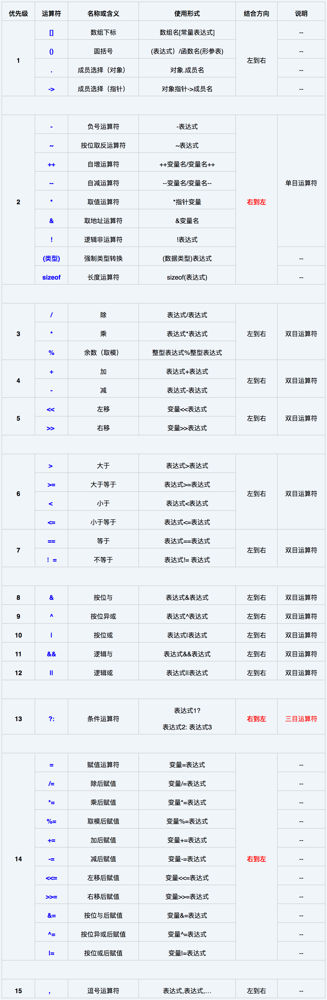

运算符有“优先级”、’“目”和“结合性”的概念：

**优先级**就是当一个表达式中有多个运算符时，先计算谁，后计算谁。

“**目**”就是“眼睛”的意思，**一个运算符需要几个数就叫“几目”**。比如加法运算符`+`，要使用这个运算符需要两个数，如 3+2，3 和 2 就像它的两只眼睛，所以这个运算符是双目的。

> C语言中大多数的运算符都是双目的，也有单目和三目的。单目运算符比如逻辑非，如`!1`，它就只有一只眼睛，所以是单目的。整个C语言中**只有一个三目运算符，即条件运算符`? :`。**

“**结合性**”是什么呢？上面讲的优先级都是关于优先级不同的运算符参与运算时先计算谁后计算谁。但是**如果运算符的优先级相同**，那么先计算谁后计算谁呢？这个就是由“结合性”决定的。

> 比如`1+2×3÷4`，乘和除的优先级相同，但是计算的时候是从左往右，即先计算乘再计算除，所以乘和除的结合性就是从左往右。

C语言中大多数运算符的结合性都是从左往右，**只有三类运算符的结合性是从右往左的。**一类是单目运算符，另一类是三目运算符，还有一类就是双目运算符中的赋值运算符`=`、`/=`、`*=`等等。双目运算符中只有赋值运算符的结合性是从右往左的，其他的都是从左往右。

> C语言的条件运算符具有这样的性质： a ? b : c ? d : e 等价于 a ? b : (c ? d : e)，因此一些人说C语言的条件运算符具有右结合性

### 运算符优先级和结合性一览表

上表中可以总结出如下规律：

1. 结合方向只有三个是从右往左，其余都是从左往右。
2. 所有双目运算符中只有赋值运算符的结合方向是从右往左。
3. 另外两个从右往左结合的运算符也很好记，因为它们很特殊：一个是单目运算符，一个是三目运算符。
4. C语言中有且只有一个三目运算符。
5. 逗号运算符的优先级最低，要记住。
6. 此外要记住，对于优先级：**算术运算符 > 关系运算符 > 逻辑运算符 > 赋值运算符**。逻辑运算符中“逻辑非 !”除外。

### 一些容易出错的优先级问题

上表中，优先级同为1 的几种运算符如果同时出现，那怎么确定表达式的优先级呢？这是很多初学者迷糊的地方。下表就整理了这些容易出错的情况：

| 优先级问题                                    | 表达式               | 经常误认为的结果                                        | 实际结果                                                     |
| --------------------------------------------- | -------------------- | ------------------------------------------------------- | ------------------------------------------------------------ |
| . 的优先级高于 *（-> 操作符用于消除这个问题） | *p.f                 | p 所指对象的字段 f，等价于： (*p).f                     | 对 p 取 f 偏移，作为指针，然后进行解除引用操作，等价于： *(p.f) |
| [] 高于 *                                     | int *ap[]            | ap 是个指向 int 数组的指针，等价于： int (*ap)[]        | ap 是个元素为 int 指针的数组，等价于： int *(ap [])          |
| 函数 () 高于 *                                | int *fp()            | fp 是个函数指针，所指函数返回 int，等价于： int (*fp)() | fp 是个函数，返回 int*，等价于： int* ( fp() )               |
| == 和 != 高于位操作                           | (val & mask != 0)    | (val &mask) != 0                                        | val & (mask != 0)                                            |
| == 和 != 高于赋值符                           | c = getchar() != EOF | (c = getchar()) != EOF                                  | c = (getchar() != EOF)                                       |
| 算术运算符高于位移 运算符                     | msb << 4 + lsb       | (msb << 4) + lsb                                        | msb << (4 + lsb)                                             |
| 逗号运算符在所有运 算符中优先级最低           | i = 1, 2             | i = (1,2)                                               | (i = 1), 2                                                   |

摘抄：http://c.biancheng.net/view/161.html

https://m.jb51.net/article/37282.htm

