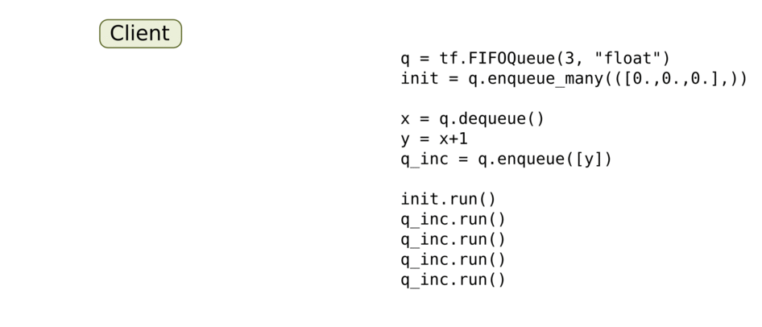

## 线程和队列

如TensorFlow中的其他组件一样，**队列就是TensorFlow图中的节点**。这是一种有状态的节点，就像变量一样：其他节点可以把新元素插入到队列后端(rear)，也可以把队列前端(front)的元素删除。



> 我们先创建一个“先入先出”的队列（FIFOQueue），并将其内部所有元素初始化为零。然后，我们构建一个TensorFlow图，它从队列前端取走一个元素，加上1之后，放回队列的后端。慢慢地，队列的元素的值就会增加。


## 队列使用概述

队列，如`FIFOQueue`和`RandomShuffleQueue`，在TensorFlow的张量异步计算时都非常重要。

一个典型的输入结构：是使用一个`RandomShuffleQueue`来作为模型训练的输入：

- **多个线程**准备训练样本，并且把这些样本推入队列。
- 一个训练线程执行一个训练操作，此操作会从队列中移除最小批次的样本（mini-batches)。

TensorFlow的**`Session`对象是可以支持多线程**的，因此多个线程可以很方便地使用同一个会话（Session）并且并行地执行操作。

然而，在Python程序实现这样的并行运算却并不容易。所有线程都必须能被同步终止，异常必须能被正确捕获并报告，回话终止的时候， 队列必须能被正确地关闭。

所幸TensorFlow提供了两个类来帮助多线程的实现：[tf.Coordinator](http://www.tensorfly.cn/tfdoc/api_docs/python/train.html#Coordinator)和[tf.QueueRunner](http://www.tensorfly.cn/tfdoc/api_docs/python/train.html#QueueRunner)。从设计上**这两个类必须被一起使用**。

- `Coordinator`类可以用来同时停止多个工作线程并且向那个在等待所有工作线程终止的程序报告异常。
- `QueueRunner`类用来协调多个工作线程同时将多个张量推入同一个队列中。


## Coordinator

Coordinator类用来帮助多个线程协同工作，多个线程同步终止。 其主要方法有：

- `should_stop()`:如果线程应该停止则返回True。
- `request_stop(<exception>)`: 请求该线程停止。
- `join(<list of threads>)`:等待被指定的线程终止。

首先创建一个`Coordinator`对象，然后建立一些使用`Coordinator`对象的线程。这些线程通常一直循环运行，一直到`should_stop()`返回True时停止。 任何线程都可以调用`request_stop()`决定计算什么时候应该停止。同时其他线程的`should_stop()`将会返回`True`，然后都停下来。

```python
# 线程体：循环执行，直到`Coordinator`收到了停止请求。
# 如果某些条件为真，请求`Coordinator`去停止其他线程。
def MyLoop(coord):
  while not coord.should_stop():
    ...do something...
    if ...some condition...:
      coord.request_stop()

# Main code: create a coordinator.
coord = Coordinator()

# Create 10 threads that run 'MyLoop()'
threads = [threading.Thread(target=MyLoop, args=(coord)) for i in xrange(10)]

# Start the threads and wait for all of them to stop.
for t in threads: 
    t.start()
    
coord.join(threads)
```


## QueueRunner

`QueueRunner`类会创建一组线程，重复地执行Enquene操作， 他们使用同一个`Coordinator`来处理线程同步终止。此外，一个`QueueRunner`会运行一个*closer thread*，当Coordinator收到异常报告时，这个*closer thread*会自动关闭队列。

```python
example = ...ops to create one example...
# Create a queue, and an op that enqueues examples one at a time in the queue.
queue = tf.RandomShuffleQueue(...)
enqueue_op = queue.enqueue(example)
# Create a training graph that starts by dequeuing a batch of examples.
inputs = queue.dequeue_many(batch_size)
train_op = ...use 'inputs' to build the training part of the graph...
```

如上：您可以使用一个queue runner，来实现上述结构。 首先建立一个TensorFlow图表，这个图表使用队列来输入样本。增加处理样本并将样本推入队列中的操作。增加training操作来移除队列中的样本。

```python
# 创建一个拥有4个线程并行执行样本数据进队操作的queue runner
qr = tf.train.QueueRunner(queue, [enqueue_op] * 4)

sess = tf.Session()
# 创建一个coordinator, 启动queue runner的线程
coord = tf.train.Coordinator()
enqueue_threads = qr.create_threads(sess, coord=coord, start=True)
# Run the training loop, controlling termination with the coordinator.
# 需要配合异常处理
try:
    for step in xrange(1000000):
        if coord.should_stop():
            break
        sess.run(train_op)
except Exception, e:
   coord.request_stop(e) # 向coordinator报告异常
    
# When done, ask the threads to stop.
coord.request_stop()
# And wait for them to actually do it.
coord.join(threads)
```

> 需要配合异常处理，详见异常处理的代码

在Python的训练程序中，创建一个`QueueRunner`来运行几个线程， 这几个线程处理样本，并且将样本推入队列。创建一个`Coordinator`，让`QueueRunner`使用`Coordinator`来启动这些线程，创建一个训练的循环， 并且使用`Coordinator`来控制`QueueRunner`的各个线程的终止。


## 异常处理

通过queue runners启动的线程不仅仅只处理推送样本到队列。他们还捕捉和处理由队列产生的异常，包括`OutOfRangeError`异常，这个异常是用于报告队列被关闭。 使用`Coordinator`的训练程序在主循环中必须同时捕捉和报告异常。 下面是对上面训练循环的改进版本。

```python
try:
    for step in xrange(1000000):
        if coord.should_stop():
            break
        sess.run(train_op)
except Exception, e:
   coord.request_stop(e) # 向coordinator报告异常

# 与往常一样结束。It is innocuous(无伤大雅) to request stop twice.
coord.request_stop()
coord.join(threads)
```


参考：[线程和队列](http://www.tensorfly.cn/tfdoc/how_tos/threading_and_queues.html)